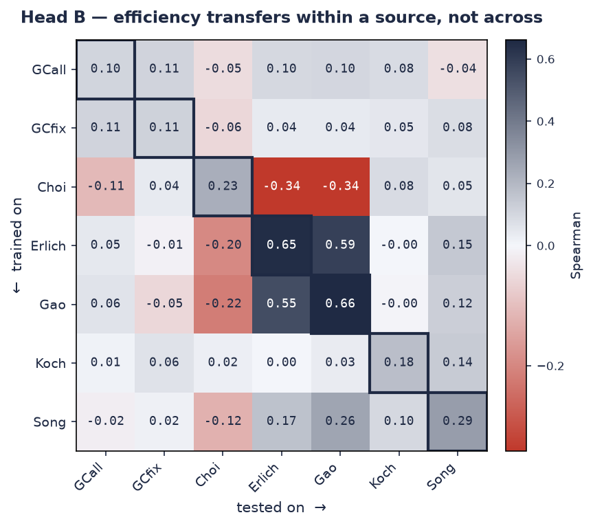

# Model card — Head B (ETH PCR-bias, cross-source generalization)

## Overview
Regression on continuous PCR efficiency across **seven synthetic-pool sources**,
used as a **cross-source generalization benchmark** — not as the copilot's
scoring model. The interesting result is how poorly a model transfers *between*
sources, which quantifies domain shift.

## Data
- **Source:** ETH PCR-bias (Gimpel et al., *Nat Commun* 2025,
  `10.1038/s41467-025-64221-4`; repo `github.com/BorgwardtLab/PCR-bias`,
  Zenodo `10.5281/zenodo.15799030`).
- **License:** BSD 3-Clause (see `data/public/ATTRIBUTIONS.md`). Fetched, gitignored.
- **Sources:** GCall, GCfix, Choi, Erlich, Gao, Koch, Song — adapter-flanked
  random synthetic pools (DNA-storage context), **93–164 nt** each.
- **Sampling:** balanced subsample of 3,000 rows/source (21,000 total) so the
  largest source (Song, ~210k) does not dominate.
- **Label:** continuous `eff`, tightly clustered (≈ 0.86–1.10).

## Features
**Length-agnostic composition only:** `gc_content` + all 3-mer frequencies (65
features). Primer duplex thermodynamics are **undefined here** — Primer3 rejects
sequences longer than 60 bp ("At least one sequence must be ≤ 60 bp"), so the
primer-oriented thermo features cannot be computed on these amplicons. That
constraint is itself the clearest evidence of the domain gap vs Source A.

## Metrics
**Internal (pooled 5-fold):**
| model | Spearman | RMSE |
|---|---|---|
| elasticnet | 0.16 | 0.009 |
| random_forest | 0.29 | 0.009 |
| **xgboost** | **0.32** | 0.008 |
| lightgbm | 0.32 | 0.008 |

**Cross-source (leave-one-source-out, xgboost):** mean Spearman **0.15**
(GCall 0.15, GCfix 0.07, Choi **−0.15**, Erlich 0.34, Gao 0.43, Koch 0.07,
Song 0.17).

**Transfer matrix (train on one source, test on each source, xgboost):** the
same story made pairwise. A single fixed per-source hold-out makes every cell
comparable — the boxed diagonal is honest *within*-source generalization, the
rest is cross-source transfer.

**Mean diagonal 0.32 vs mean off-diagonal 0.04** — efficiency signal barely
survives a source change. The structure is real, not noise: Erlich and Gao
transfer strongly to *each other* (0.55–0.66) while Choi is adversarial to them
(−0.34), so "PCR efficiency" is partly a per-experiment quantity, not a single
universal function of sequence.

**The internal (0.32) vs cross-source (0.15, one source negative) gap is the
domain-shift signal.**

## Known limitations
- **Modest absolute Spearman** — the efficiency range is narrow and tabular
  composition features are weak relative to the source paper's 1D-CNN on raw
  sequence. We are **not** claiming to beat their model; the point is the
  transfer structure.
- **Out of domain for designed qPCR primers.** These are synthetic pools; the
  copilot deliberately does **not** use head B for scoring.
